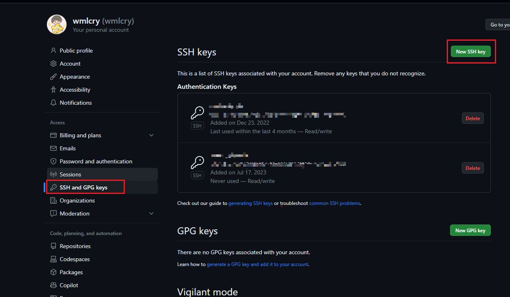

# Git 开发环境

> 由于开发一般在 linux 的服务器上，因此下文只进行linux上设置的总结，window 则简单类推、如法炮制。

## 1、安装 git、gitk

这一步一般现代版本的linux装系统后就已经有了，可以不用装。不过为了确保安装，可以执行该命令以确认是否安装。

``` bash
sudo apt-get install git-core gitk git-gui
```


## 2、安装 openssh client

``` bash
$ sudo apt-get install openssh-client
```

（这一步一般Linux都有了，可以不用装）

检查有没有 `home/user/.ssh` 目录，没有的话用 `ssh-keygen` 生成。ssh 是管理和转换认证的密钥，包括 **RSA** 和 **DSA** 两种密钥。


## 3、初始化本地用户

``` bash
# git config --global user.name yourname
# git config --global user.email youremail

# 示例
git config --global user.name "meng.wang"
git config --global user.email "meng.wang@simcom.com"
```


## 4、生成 rsa 密钥

执行以下命令生成 ssh 私钥和公钥 

``` bash
# ssh-keygen -t rsa -C email@address

# 示例
ssh-keygen -t rsa -C meng.wang@simcom.com
```

一路回车，不用输密码，在 `home/user/.ssh` 目录会生成 `id_rsa` 和 `id_rsa.pub` 两个文件。


## 5、添加公钥到 Github 服务器。

生成密钥后把本地目录下的 `ssh/id_rsa.pub` 文件内容复制到 Github 的 Settings -> SSH and GPG keys 然后 New SSH key，添加你的公钥信息。 



本地一旦公钥添加到服务器上，不能随便在本地生成公私钥，一旦生成就要更替你在服务器上旧的公钥。

所以公钥和私钥我们最好保存一份，如果要重新装机，我们可将生成公钥和私钥内容替换成原有公钥私钥内容。


## 6、设置终端免密登录

将远程服务器的公钥复制到本地，或者将本地的公钥复制到远程服务器。当然如果是个人使用，服务器和本地完全可以一份公钥私钥。

然后

```bash
cat id_rsa.pub >> authorized_keys
sudo chmod 600 authorized_keys
service sshd restart
```

可能在最后一条命令要输出你的账号登录密码。
这样远程ssh主机配置免密码登录就完成了，这个时候我们打开终端远程 SSH 服务器就不需要输入密码了，使用 VS Code 的 ssh 服务同样远程过去不需要输入密码。


## 7、Git 账户迁移（补充）

作为补充情况，如果你重装了系统，又需要使用旧的公钥私钥。如果是个人仓库还好，要是公司的仓库你这个公钥提给 SCM，它就很麻烦。

私钥默认名为 id_rsa ,公钥默认名为 id_rsa.pub ;将旧系统中的 **.ssh 目录** 直接复制到新系统的（Windows: C:\Users\xxx， linux: ~/）目录下即可；

### 迁移全局配置文件

命名为 .gitconfig （系统用户目录下）的文件，该文件中存放着用户名；可以直接将该文件复制至新系统的用户目录下即可。

### 启用ssh-rsa算法

8.8p1 版的 openssh 的 ssh 客户端默认禁用了 `ssh-rsa` 算法, 但是对方服务器只支持 `ssh-rsa`, 当你不能自己升级远程服务器的 openssh 版本或修改配置让它使用更安全的算法时, 在本地 ssh 针对这些旧的ssh server重新启用 `ssh-rsa`

编辑用户 ssh 配置 `~/.ssh/config`, 对于无法成功连接的host, 增加配置项:

``` bash
HostKeyAlgorithms         +ssh-rsa
PubkeyAcceptedKeyTypes    +ssh-rsa
```

