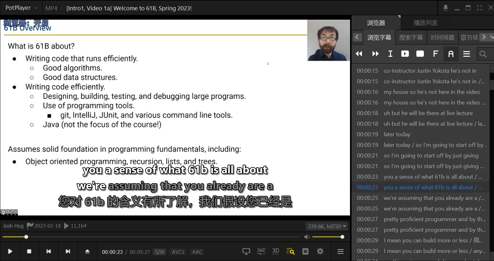
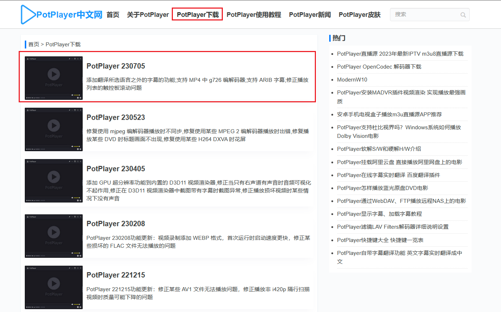
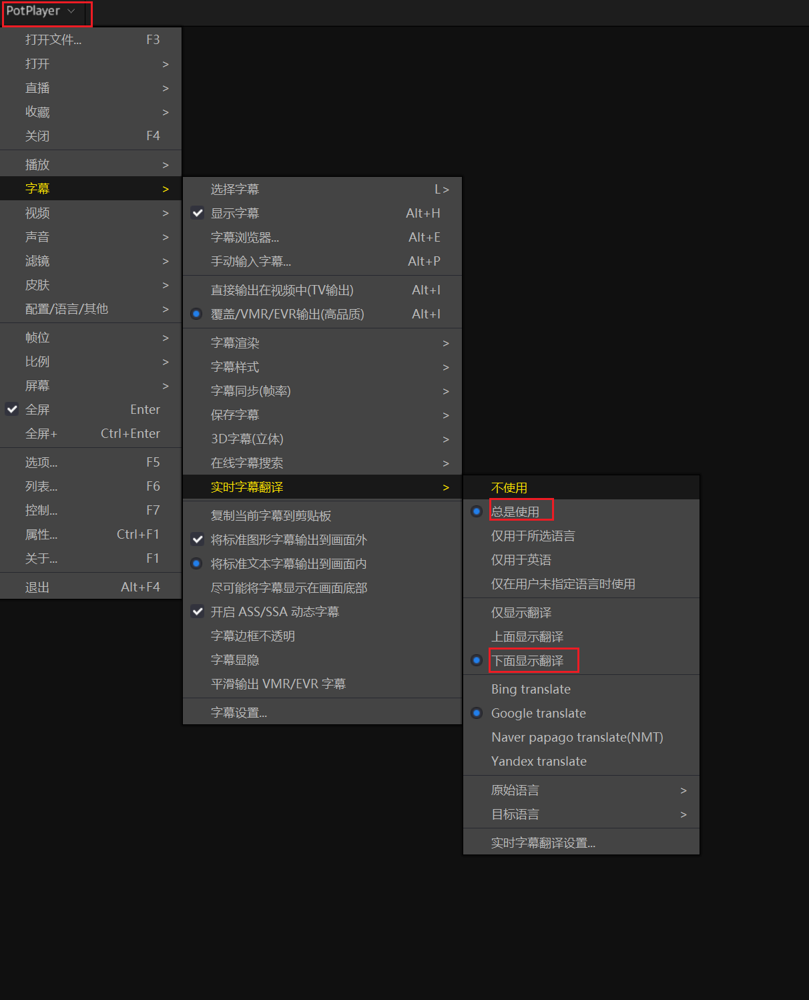
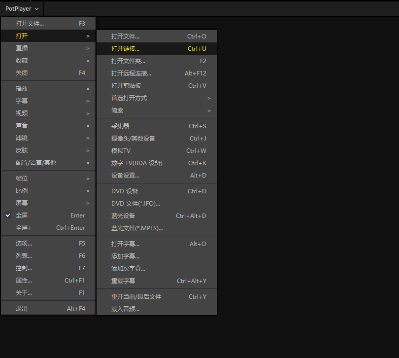
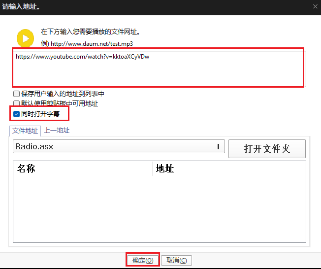
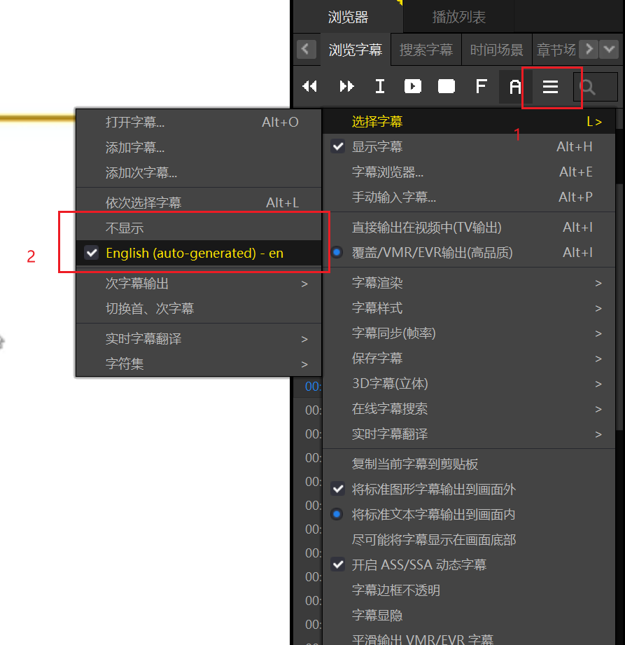

# 英文视频材料处理

对于英文视频材料处理，主要是基于 **PotPlayer** 这个工具，借助该工具的实时字幕翻译功能，能够辅助同学们的英文视频材料的学习。

## 下载 PotPlayer

可以到 [PotPlayer中文网](http://www.potplayercn.com/) 进行下载，点击 PotPlayer下载 ，然后选择第一个最新的版本。

你如果觉得在该网站下载速度较慢，可以用我分享的的阿里云网盘资源链接（目前是230705版本，后续不会更新）。

**阿里云盘**：https://www.aliyundrive.com/s/VFFuznzXa4w 

安装步骤就不讲了。

## 实时字幕翻译

打开工具，选择 PotPlayer -> 字幕 -> 实时字幕

- 选择总是使用
- 选择下面显示翻译（看个人习惯了）
- 翻译引擎自己选择，推荐 Google translate 

## 测试

**1、首先找一个英文在线视频链接**

测试视频链接：https://youtu.be/kktoaXCyVDw?list=PL8FaHk7qbOD6NlIHCjmKSpUudMA-8bMA1

2、打开 Potplayer，选择 Potplayer -> 打开 -> 打开链接

粘贴你刚刚复制的视频链接，然后选择同时打开字幕，点击确定，等待视频加载。

3、如果加载后的视频没有字幕，可能是你没打开自动字幕生成。点击 1 处，然后点击 2 处，English（auto-generated）-en。

## 最终效果

可以看到最终效果是很好的，双字幕显示。

如果某一段话翻译的不是很好，你还可以复制这段字幕到其它翻译工具上进行比较。

