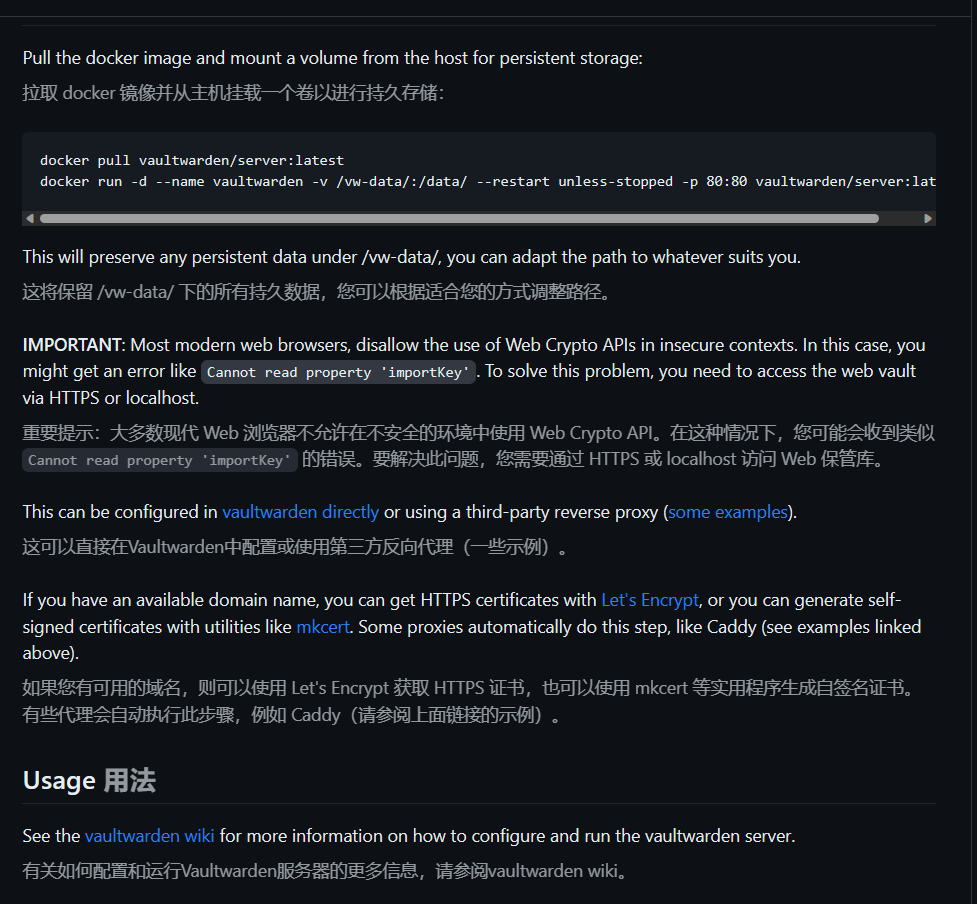
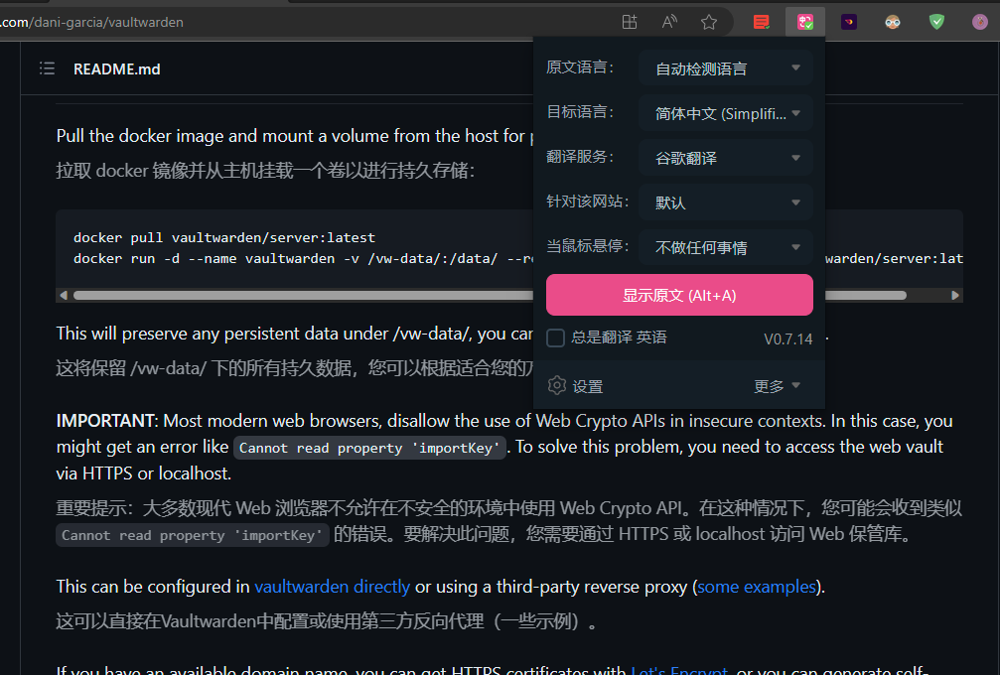

# 英文文字材料处理

通过借助浏览器插件——[沉浸式翻译](https://microsoftedge.microsoft.com/addons/detail/%E6%B2%89%E6%B5%B8%E5%BC%8F%E7%BF%BB%E8%AF%91/amkbmndfnliijdhojkpoglbnaaahippg)。

## 使用方法

我把这个插件放在工具栏上，需要用到的时候，直接点击该插件，点击翻译。

